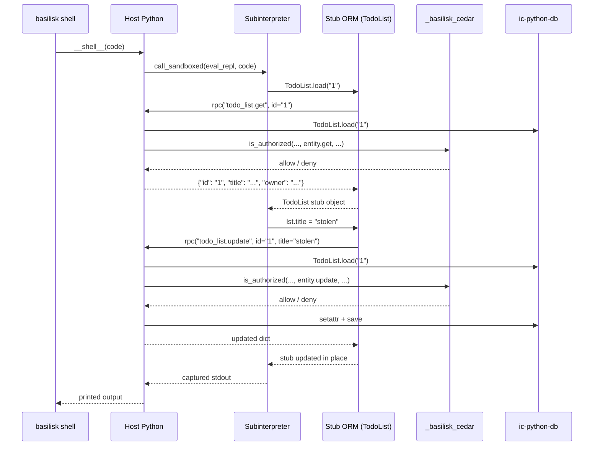

# SecureEntity: sandboxed ORM with Cedar owner policies

How a canister can give every user a live Python REPL — yet guarantee nobody can
touch another user's rows. This is the pattern behind
[`SecureEntity`](../ic_basilisk_toolkit/secure_orm.py) and the
[todo_list template](../templates/todo_list).

## What the user writes

Users type ordinary **ic-python-db-style** code in the shell. They never call
`rpc()` themselves:

```python
lst = TodoList.load("1")
lst.title = "shopping"
TodoItem.create(title="milk", todo_list=lst)
TodoList.instances()   # Cedar-filtered to rows you may see
```

Under the hood, the sandbox runs **generated stub classes** (`TodoList`,
`TodoItem`, …) that look like the real ORM but delegate every operation to an
internal `rpc(action, **kwargs)` bridge. That bridge is the only way out of the
sandbox.

## The three layers

| Layer | Where it runs | What it can do |
|-------|---------------|----------------|
| **Stub ORM** (subinterpreter) | per-caller isolated CPython | `TodoList.create`, `load`, attribute writes, … — each becomes an internal `rpc()` call. No real DB, no Cedar, no `_basilisk_ic`. |
| **Host RPC dispatch** | main interpreter | Receives internal `rpc(action, **kwargs)`, runs Cedar check, then touches the real DB. |
| **Cedar** | native module (`_basilisk_cedar`) | Decides: may this principal perform this action on this row? |

User code never reaches layers 2 and 3 directly. Everything crosses as
**plain data** (`str`/`int`/`bool`/`list`/`dict`), deep-copied both ways.

## One call, step by step

A user in `basilisk-toolkit shell` types:

```python
lst = TodoList.load("1")
lst.title = "stolen"
```

Here is exactly what happens:



### Step 0 — one-time setup

`setup_secure_orm([TodoList, TodoItem], namespace="TodoApp", principal_type="User")`
does all wiring:

1. Builds a Cedar **schema** from the entity definitions (`generate_cedar_schema`).
2. Generates **owner-only policies** (`resource.owner == principal.id`, plus
   `resource.<parent>.owner == principal.id` for children reached via `ManyToOne`).
3. Loads schema + policies into `_basilisk_cedar` at canister init — parsing is
   expensive (~20M instructions), so it happens once, never per request.
4. Generates a **stub module** — stub ORM classes plus `eval_repl`; the only
   source the sandbox is allowed to run.

### Step 1 — `__shell__(code)` on the host

```91:92:ic-basilisk-toolkit/templates/todo_list/src/main.py
@update
def __shell__(code: str) -> text:
    return orm.shell(code)
```

`code` is the literal line typed in the shell, e.g.
`'lst = TodoList.load("1")\nlst.title = "stolen"'`. `ic.caller()` gives the
caller's principal — the identity Cedar evaluates against.

### Step 2 — spawn or reuse the caller's sandbox

Each principal gets its own subinterpreter handle (cached in `self._sandboxes`).
The sandbox is spawned with:

- the generated **stub source** (approved by SHA-256 content hash),
- a **capability** listing the allowed internal RPC actions (`todo_list.create`,
  …, `todo_item.delete`) — anything outside this list is refused by the C layer
  before your handler runs,
- a deterministic **instruction budget**.

```700:712:ic-basilisk-toolkit/ic_basilisk_toolkit/secure_orm.py
        handle = self._sandboxes.get(principal_id)
        if handle is None:
            handle = spawn_sandboxed(
                self._stub_source,
                self._sandbox_hash,
                cap,
                handler,
                budget=self._budget,
            )
            self._sandboxes[principal_id] = handle

        try:
            result = call_sandboxed(handle, "eval_repl", {"code": code})
```

`eval_repl` puts `TodoList`, `TodoItem`, … and the internal `rpc` builtin into
the namespace, then `exec`s the user's code.

### Step 3 — user code hits stub classes (not the real ORM)

`TodoList.load("1")` runs generated stub code:

```173:176:ic-basilisk-toolkit/ic_basilisk_toolkit/secure_orm.py
            "    @classmethod",
            "    def load(cls, id):",
            "        return cls.get(id)",
```

which calls `get` → internal `rpc("todo_list.get", id="1")` → host returns a
plain dict → stub wraps it as `TodoList({...})`.

Attribute writes use the same pattern — the user assigns on the stub; the stub
calls `rpc` internally:

```238:244:ic-basilisk-toolkit/ic_basilisk_toolkit/secure_orm.py
    def __setattr__(self, name, value):
        if name.startswith("_") or name == "id":
            object.__setattr__(self, name, value)
            return
        data = object.__getattribute__(self, "_data")
        rpc(self._prefix + ".update", id=data["id"], **_Stub._rpc_kwargs({name: value}))
        data[name] = value
```

There is no `import ic_python_db` in the sandbox — the real entity classes are
absent; only the generated stubs exist.

### Step 4 — host dispatch and Cedar check

Each internal `rpc()` lands in `handle_rpc`, which maps `prefix.op` to a CRUD
method on the **real** entity classes. Before any mutation or read, Cedar runs:

```597:603:ic-basilisk-toolkit/ic_basilisk_toolkit/secure_orm.py
    def _update(self, cls: Type[SecureEntity], principal_id: str, kwargs: Dict[str, Any]) -> dict:
        kwargs = dict(kwargs or {})
        row_id = str(kwargs.pop("id", ""))
        row = self._load_row(cls, row_id)
        self.engine.check(
            principal_id, "entity.update", cls.__name__, row_id, row
        )
```

`engine.check` builds a **minimal entity slice** and calls
`_basilisk_cedar.is_authorized`. The generated policy decides:

```cedar
permit (principal, action, resource is TodoApp::TodoList)
when { resource has owner && principal has id
       && resource.owner == principal.id };
```

If the caller's principal doesn't match `owner`, Cedar denies, the host raises
`PermissionError`, and the stub/sandbox sees plain error text — no partial write.

Two host-side invariants:

- **Ownership is stamped, never taken**: on `create`, the host sets
  `owner = principal_id` and ignores any `owner` from the sandbox.
- **Lists are Cedar-filtered**: `TodoList.instances()` in the stub calls
  `rpc("todo_list.list")`; the host returns only rows that pass
  `engine.is_authorized(..., entity.list, ...)`.

### Step 5 — back across the boundary

Allowed results travel back as plain dicts; stub objects wrap them. Captured
stdout is returned as the Candid string to the terminal.

## Why this is safe to expose

1. **Isolation by construction** — sandbox has no privileged imports; stubs can
   only reach the host via internal `rpc()`, and the C layer refuses unlisted actions.
2. **Every host RPC is authorized** — no path to update/delete skips
   `engine.check`; child creation also checks the parent's `entity.update`.
3. **Cedar is fail-closed** — if the engine can't decide, the handler raises
   `PermissionError`.
4. **Plain data only** — no live object references cross the boundary.

## Requirements

- The **Cedar canister template** (`cpython_canister_template_cedar.wasm`) —
  the demo fails closed without it; see the template README.
- `basilisk.sandbox` in the installed `ic-basilisk` (subinterpreter support).

See [templates/todo_list](../templates/todo_list) for a working project with
tests, and `ic_basilisk_toolkit/secure_orm.py` for the implementation.
